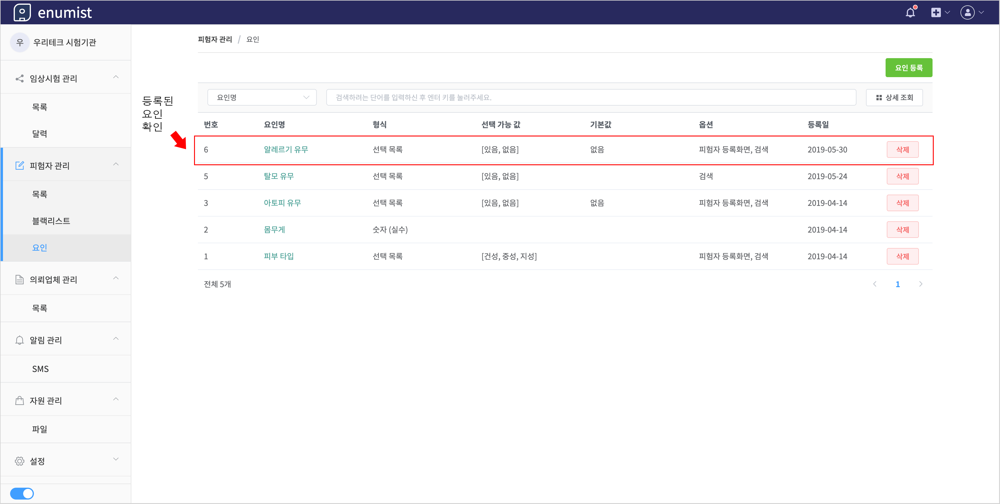
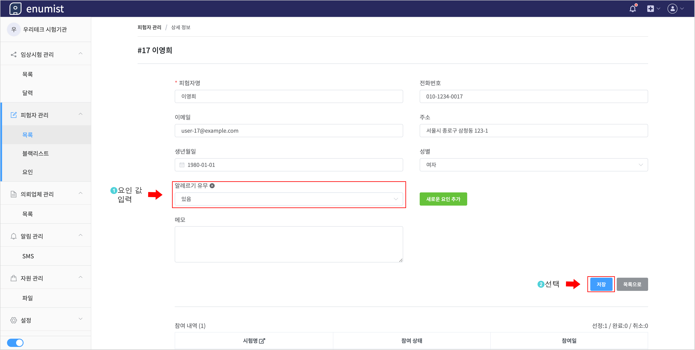

# 요인 등록하기

`요인`는 피험자의 기본 정보(이름, 성별 등)외에 추가적인 정보를 관리할 때 사용됩니다.

## 1. 요인 등록 창 생성

## 2. 요인 정보 입력

- `요인 형식`
  - `선택 목록`: 복수의 값 중 한 개의 값을 선택
    - 예시: `알레르기 유무` - (`있음`, `없음`)
  - `문자열`
    - 예시: `병력` - `피부질환 이력 있음`
  - `숫자(정수)`
    - 예시: `충치 개수` - `3`
  - `숫자(실수)`
    - 예시: `몸무게` - `75.3`
  - `날짜`:
    - 예시: `최근 병원 치료일` - `2019-03-01`
- `기본값`
  - 값이 지정되지 않은 경우 기본으로 적용되는 값
- `[옵션] 피험자 등록화면에 포함`
  - 피험자 등록 시, 해당 요인이 자동으로 추가됨
- `[옵션] 검색 옵션에 포함`
  - 피험자 검색 시, 해당 요인으로 검색할 수 있음

- `요인 형식`은 최초 등록한 이후에는 변경할 수 없습니다.
- 별표가 표기된 항목은 필수 입력 항목입니다.

## 3. 등록된 요인 확인

## 4. 피험자에 요인 추가 - 1

## 5. 피험자에 요인 추가 - 2

## 6. 피험자에 요인 추가 - 3

