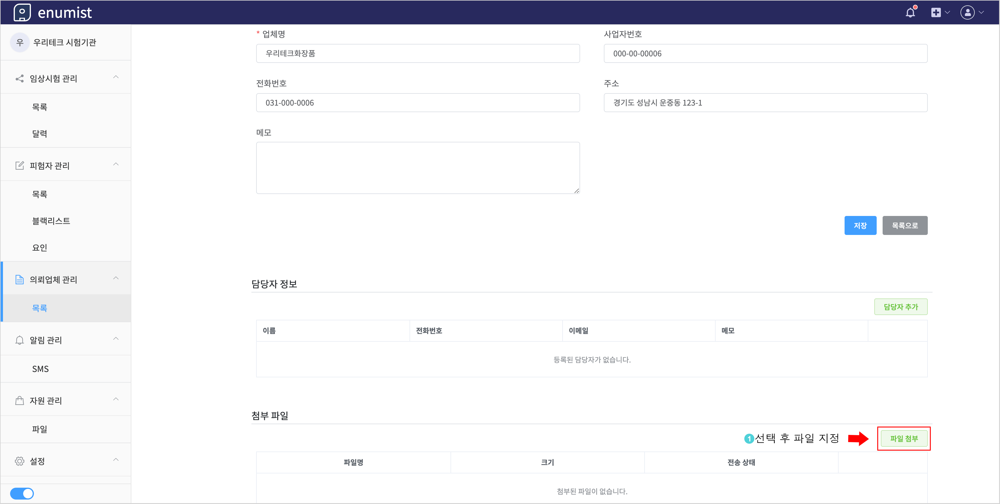
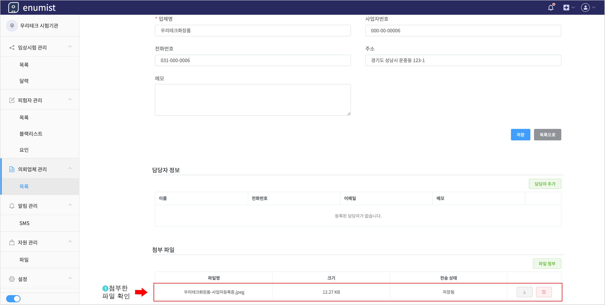

# 파일 첨부하기

의뢰업체 또는 참여자 정보에 첨부파일을 등록하고 관리할 수 있습니다.

- 의뢰업체
  - `의뢰업체 목록 화면` - `의뢰업체 선택` - `파일 첨부`
- 참여자 알림
  - `임상시험 목록 화면` - `임상시험 선택` - `참여자 탭` - `참여자 선택` - `파일 첨부`

## 1. 의뢰업체에 파일 첨부하기

## 2. 첨부한 파일 확인

## 3. 전체 첨부 파일 목록에서 확인

