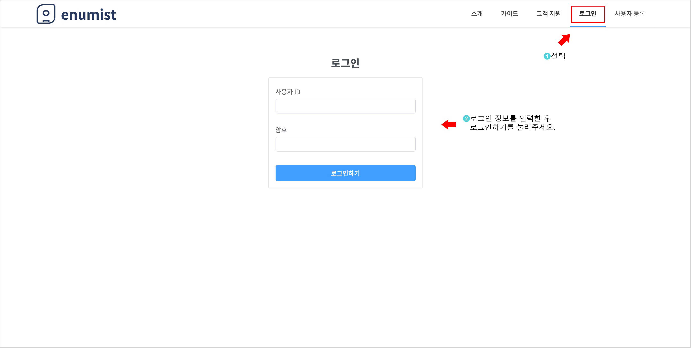
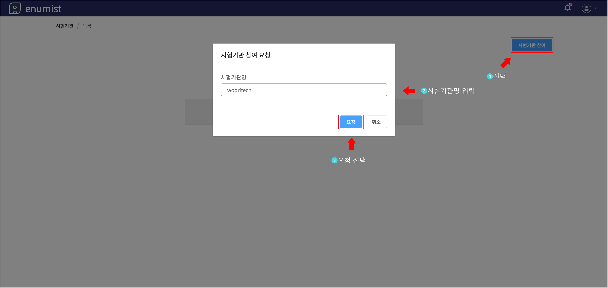
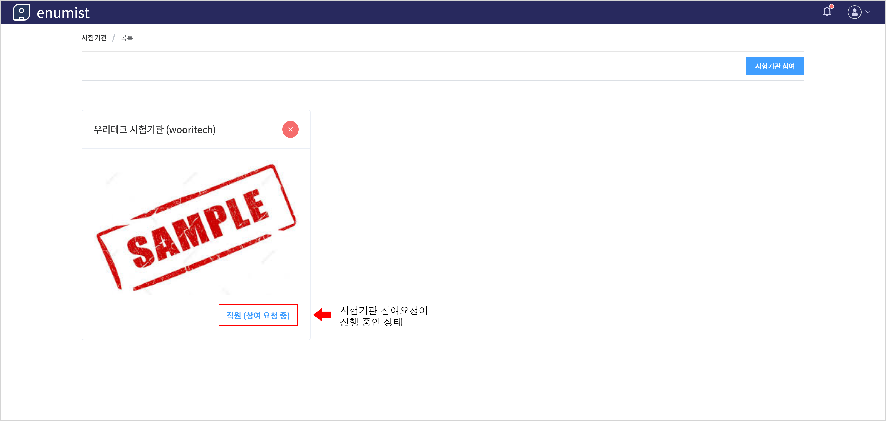
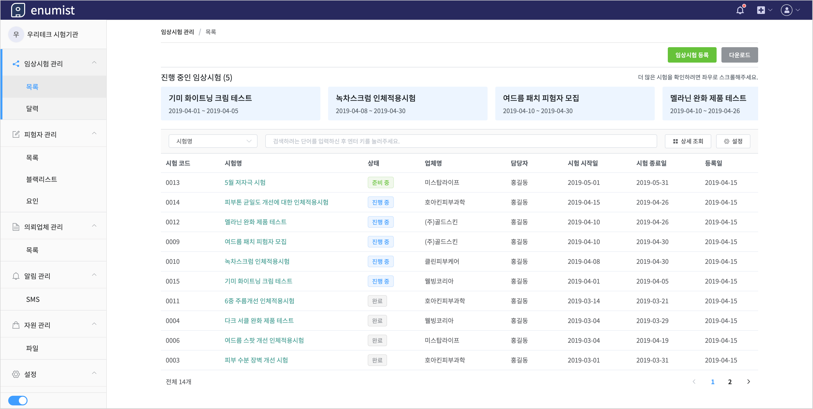

# 시험기관 참여하기

`사용자 등록` -> `로그인` -> `시험기관 참여요청` -> `참여 대기` -> `승인` 절차를 통해 시험기관에 참여할 수 있습니다.

## 1. 사용자 등록

## 2. 로그인

## 3. 시험기관 참여 요청

- 시험기관명을 모르는 경우, 해당 시험기관의 관리자에게 문의하세요.

## 4. 시험기관 참여 대기

- 시험기관 관리자가 참여요청을 승인하기 전에는 `참여 대기` 상태가 유지됩니다.

## 5. 시험기관 참여 승인

- 시험기관 관리자가 참여요청이 승인하면, 해당 시험기관의 `임상시험 목록 화면`으로 전환됩니다.